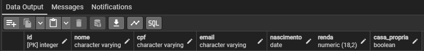
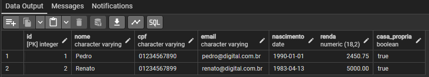
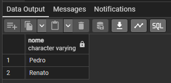
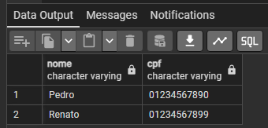

# Projeto de Banco de Dados - SQL/PostgreSQL

Desenvolvimento de Projeto de Banco de Dados com SQL/PostgreSQL. `Exercício 02, Módulo 01 (SQL)`. 

Instituição: [Digital College Brasil](https://digitalcollege.com.br/) (Fortaleza/CE) <br>
Curso: Data Analytics (Turma 18) <br>
Instrutora: [NayaraWakweski](https://github.com/NayaraWakewski) <br>

<br>

## Etapas de Desenvolvimento

### 1ª Etapa
- Criar o banco de dados: digital (Através da interface gráfica).

<br>

### 2ª Etapa
- Criar o Schema: rh.
```
CREATE SCHEMA IF NOT EXISTS rh;
```

<br>

### 3ª Etapa
- No Schema rh, criar a tabela: pessoa.
```
CREATE TABLE IF NOT EXISTS rh.pessoa (
    id serial NOT NULL PRIMARY KEY,
    nome character varying,
    cpf character varying,
    email character varying,
    nascimento date,
    renda numeric (18,2),
    casa_propria boolean
);    
```

- Checar as colunas e tipos de dados que foram criados.
```
SELECT * FROM rh.pessoa;
```

- Visualização <br>


<br>

### 4ª Etapa
- Inserir valores na tabela: rh.pessoa.
```
INSERT INTO rh.pessoa (nome, cpf, email, nascimento, renda, casa_propria) VALUES 
    ('Pedro', '01234567890', 'pedro@digital.com.br', '1990-01-01', 2450.75, true),
    ('Renato', '01234567899', 'renato@digital.com.br', '1983-04-13', 5000.00, true);
```

- Checar valores inseridos na tabela: rh.pessoa.
```
SELECT * FROM rh.pessoa;
```

- Visualização <br>


<br>

### 5ª Etapa
- Visualizar apenas uma coluna da tabela: rh.pessoa.
```
SELECT nome FROM rh.pessoa;
```

- Visualização <br>


<br>

### 6ª Etapa
- Visualizar duas colunas da tabela: rh.pessoa.
```
SELECT nome, cpf FROM rh.pessoa;
```

- Visualização <br>


<br>

## Meus Contatos

- Business Card - [Renato Albuquerque](https://rma-contacts.vercel.app/)
- Linkedin - [renato-malbuquerque](https://www.linkedin.com/in/renato-malbuquerque/)
- Discord - [Renato Albuquerque#0025](https://discordapp.com/users/992621595547938837)
